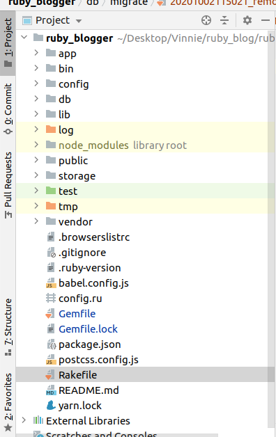
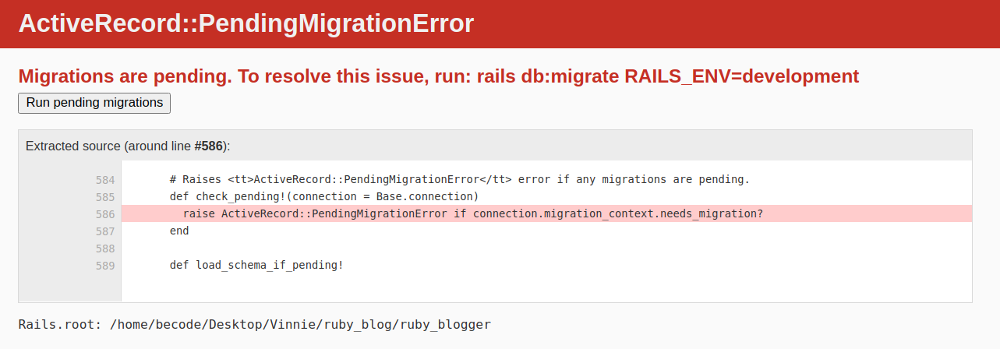

# Get Rolling on (Ruby on) Rails

- Type of Challenge: `Learner Workshop`
- Duration: `3 hours`

## Learning objectives
- Install Ruby, Rails
- Setup your first project
- Learn the basics of Ruby on Rails through building a simple weblog
  - Learn your way around the file structure
  - Learn to use the MVC layer of Ruby on Rails
  - Learn to use the routing component
  - Learn about RubyGems
  - Learn about HTTP handling
  

## The Mission
In this workshop, I would like to guide you through the first steps of learning Ruby on Rails by building a weblog together. You will run into some familiar concepts like the MVC model, HTTP requests, routing and templates, and will also work with a virtual database that will store all the information you are adding to your web server. 

For Lamarr, all of this should remind you very much of Symfony. For Giertz, I will try to help you as much as I can where needed, but will always try to supply enough documentation for you to find your way as well.

### Step 1: Install Ruby and Rails (10 minutes)

#### Installing Ruby

It's always worth checking if your computer came with Ruby preinstalled, or maybe you at some point installed it and never touched it again. You can do so by typing the following, usual code in your terminal: 

```
ruby -v
```

If this returns a message similar to:

```
ruby 2.6.3p62 (2019-04-16 revision 67580) [x86_64-linux]
```
... Then you're set! Otherwise, you can follow this link for the different installation methods depending on your operating system:
https://www.ruby-lang.org/en/documentation/installation/

For us Linux/Ubuntu users, i'll include the very simple terminal command you will need:

```
$ sudo apt-get install ruby-full
```

#### Installing Rails

Next up, we need to install Rails itself, as it will allow us to generate a plethora of things that have been prebuilt for us, which will help us set up our own weblog without much difficulty. For that, I will also include a link to an external source:

http://guides.railsgirls.com/install

Follow the steps for your specific system all the way up to having installed Rails. You do not need to install any text editors anymore, since you either decided to install RubyMine or chose to work with your own editor of choice. 

If you did not install RubyMine, but still wish to, you can follow the link below this line. Just log in with your JetBrains credentials and download it for free:

https://www.jetbrains.com/ruby/promo/?gclid=CjwKCAjwzvX7BRAeEiwAsXExoxwQlLse8C3ll7BnBb5O54LiAW-2PT_ROQ3skOHt3u6QSkEKoaXpnxoCtWwQAvD_BwE

### Step 2: Starting our project and navigating the directories

#### initializing the project and our repository

Now that we have Ruby, Rails and a suitable text editor, we can start by setting our own directories and subsuequently navigate the directories from Ruby on Rails as well.

- First use the terminal to navigate to the directory you want to store your project in.
- Once there, use the following command to generate the main files for your project:

```
rails new yourProjectName
```

I suggest you use a name like rubyBlog, blogger, or something that will remind you what the project was all about in a few weeks ;) 

Now, let's move on to setting up our repository online and connecting it to this directory. Go to your own github and make a new repository, but do not initialize it with a README.md.

Next, navigate into your new Rails project and initialize your git using the ```git init ``` command. After that, you will need to add all the files you find there to your git staging area by using ``` git add .```. And like always, follow this by commiting it with a message using ```git commit -m "my message" ```.

Having done this, you would follow this with your usual git push, but first we need to set up our remote repository still. You do this using the usual SSH key along with the following command 

```
$ git remote add origin yourSSHkey
# Sets the new remote
$ git remote -v
# Verifies the new remote URL
```
If all goes well, that last command will return the URL of the repository that has been linked to.

Now we can finish it up by setting up our upstream branch by adding something to the usual ``` git push origin master ``` command:

```
    git push --set-upstream origin master
```

And we're ready to go!

#### Navigating the files in Rails

Let's open up our project in our text editor, shall we?

Once open, you should see something similar to this:



Let's go over them one by one!

- `app` - This is where almost all of our own code an effort will go. This will contain all the subfolders for your different models, controllers and views, all usually separated over their respective object directories. In addition, this also holds the /assets directory where you will store your images and your stylesheets, and also has the javascript directory for all your scripts and packages that you wish to install on top of it.

- `bin` - This is where your app’s executables are stored: bundle, rails, rake, and spring. We will not be going into this directory manually, only through the bundles that we want to use for other purposes.

- `config` - Control the environment settings for your application. Important for this project and any other is the 'routes.rb' file, which will determine the pathing and routing for our eventual website. More on that later.

- `db` - Will eventually have a migrations subfolder where your migrations, used to structure the database, will be stored. When using SQLite3, as is the Rails default, the database file will also be stored in this folder.

- `lib` - This folder is to store code you control that is reusable outside the project. I have yet to use this myself as I am just starting to grasp Rails as well

- `log` - Contains logs for your development and deployment, but to me personally this is all still Chinese and I do not know how to read them

- `public` - For those familiar with Symfony, this is where you would expect your views and your index, and although this used to be the case, it has all moved up to the app folder since Rails 3.1.

- `test` - Only applicable if your using the default Test::Unit testing library, but we will not explore that in this workshop.

- `tmp` - Stores our temporary cached files

- `vendor` - Infrequently used, this folder is to store code you do not control. With Bundler and Rubygems, we generally don’t need anything in here during development.

Outside of the directories, we see some other files with various extensions. One that we have already talked about briefly is included here too: the Gemfile

Open it up and you can see the general structure of the file and some of the preloaded gems like this:

```
source 'https://rubygems.org'
git_source(:github) { |repo| "https://github.com/#{repo}.git" }

ruby '2.6.3'

# Bundle edge Rails instead: gem 'rails', github: 'rails/rails'
gem 'rails', '~> 6.0.3', '>= 6.0.3.3'
# Use sqlite3 as the database for Active Record
gem 'sqlite3', '~> 1.4'
# Use Puma as the app server
gem 'puma', '~> 4.1'
# Use SCSS for stylesheets
gem 'sass-rails', '>= 6'
# Transpile app-like JavaScript. Read more: https://github.com/rails/webpacker
gem 'webpacker', '~> 4.0'
# Turbolinks makes navigating your web application faster. Read more: https://github.com/turbolinks/turbolinks
gem 'turbolinks', '~> 5'
# Build JSON APIs with ease. Read more: https://github.com/rails/jbuilder
gem 'jbuilder', '~> 2.7'
```
You can see they are included with the prefix 'gem', written between quotations themselves and optionally followed by their version number. This is one way you will find gems on the internet; if you include them like this and then run your 'Bundle' tool in your terminal, you will install that gem! Easy, right? We'll install a few gems in just a moment.

#### Starting our localhost

This is a very simple step: much like Php, Rails and Ruby also have a virtual server hosting tool. You can start it up with the following terminal command, while in the directory of your project:

```
rails s 
# or 
rails server
```
This will, by default, open up a live server on http://localhost:3000

Go check it out, and you should see the following screen: 


In case you have an error, this might be because you do not have SQLite3 installed (when on Windows). If this is the case, follow the following link and make sure you check the box to *configure your environment variables*. Once this is done, restart your system, start your server up again and try loading the page again.

That's all we'll need for now, let's get cracking with the actual code now!

### Step 3: Starting up our first models

#### The scaffolding magic

Now, let us start by showcasing the power of a framework like Rails. In Rails, there is a concept called 'scaffolding'. This would generally translate to 'stellingen' or 'een stelling', and is a metaphor for something, but for what?

Let's try generating the scaffolding for our blog articles. Open up your terminal and type:

```
rails generate scaffold Article title:string body:text
```

Execute that and... Tada! Wait, what just happened?

Rails went and did some of the boring and tedious coding work for you by creating a lot of different files and directories for your new Article model. In your terminal, you see this:

```
 invoke  resource_route
       route    resources :smurves
      invoke  scaffold_controller
      create    app/controllers/smurves_controller.rb
      invoke    erb
      create      app/views/smurves
      create      app/views/smurves/index.html.erb
      create      app/views/smurves/edit.html.erb
      create      app/views/smurves/show.html.erb
      create      app/views/smurves/new.html.erb
      create      app/views/smurves/_form.html.erb

``` 
Going over these lines, you can see snippets like 'create app/models/smurf.rb', 'create app/controllers/smurves_controller.rb' , 'create app/views/smurves...'. Those are the three main parts of our MVC design pattern, just right there for you already!

#### The RESTful Actions in action

Let's open up the article_controller in our directory and see what it looks like. You can find it under `./app/controllers/articles_controller.rb`.

At first glance, you can see that there is a lot going on already. But if you look closely, you can see that Rails went along and made all the necessary actions or methods for a typical RESTful setup: `index`, `show`, `new`, `edit`, `create`, `update` and `destroy`.

Take a look at the index action.

```
 # GET /articles
 # GET /articles.json
def index
  @articles = Article.all
end 
```
The first two lines are comments which indicate at what route you can access this page. If you add `/articles` to your http://localhost:3000, you should arrive at this page. But before we try that, let's go over the actual action.

We open up de action or function with the def keyword and call it index, which is important since Rails will be able to identify and connect the index route `/articles` to this. This falls in the 'Convention-over-Configuration' principle, which comes down to only deviating from convention if necessary. We could call this homepage, but then we would also have to go and configure our routing ourselves. That sounds like too much work, right?

Inside the method, we declare the instance variable `@articles` which will be equal to all instances known of an `Article` object. For this, Rails will go and call upon your database and look for all datasets that correspond to our model. Maybe you should try and open up this path and see what happens? navigate to http://localhost:3000/articles.

 
